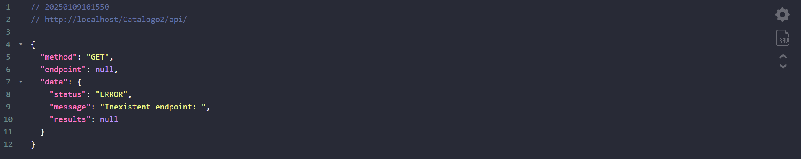
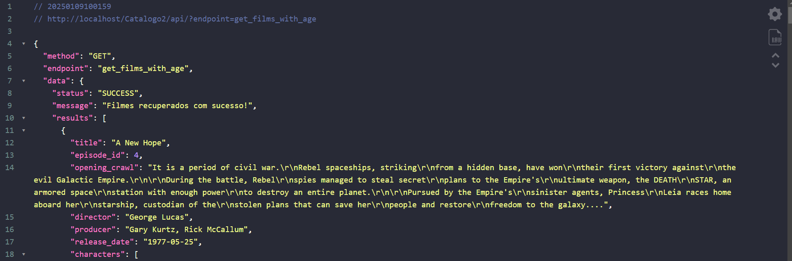
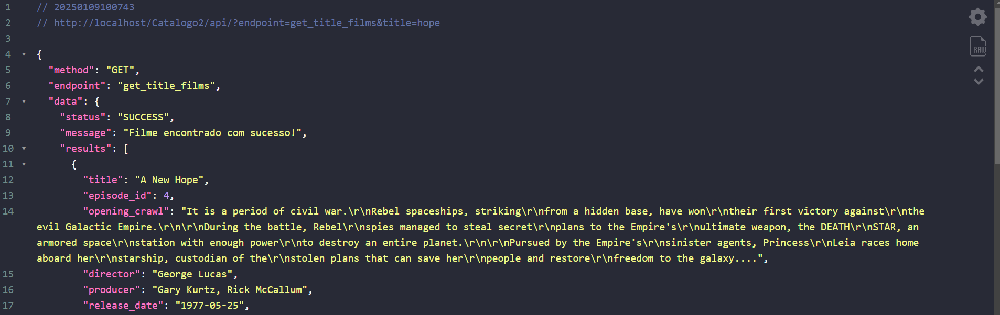

# Documentação 
## Introdução
- Bem-vindo à minha API! Esta documentação deve ajudá-lo a se familiarizar com os recursos disponíveis e como consumi-los utilizando solicitações HTTP.

## Começando
- Vamos fazer nossa primeira solicitação
### URL BASE
- A URL base é o ponto de partida para acessar nossa API.
- URL Base: http://localhost/Catalogo/api/

### Autenticação
-  A API é completamente aberta. Nenhuma autenticação é necessária para consultar e obter dados.

### Procurando
- Todos os nossos recursos têm diferentes maneiras de realizar buscas pela URL.

### Codificações

- JSON é o formato de dados padrão.

# Recursos

- Raiz - nossa **`URL BASE`** - **`http://localhost/Catalogo/api/`** sempre retorna um erro de endpoint.

**`Exemplo de solicitação:`**

- **`http://localhost/Catalogo/api/`**

**`Exemplo de resposta:`**

## Atributos de Endpoint
- 1 - `get_films_with_age` -> Retorna todos os filmes.
- 2 - `get_films_title`    -> Retorna os títulos de todos os filmes.
- 3 - `get_planets_films`  -> Retorna todos os planetas de todos os filmes.

Como usar: 
- Teremos a URL BASE -> **`http://localhost/Catalogo/api/`** Apois o **`api/`** coloque `?endpoint=` logo depois de endpoint coloque um `Atributo`.

**`Exemplo de solicitação:`**
- http://localhost/Catalogo/api/?endpoint=get_films_with_age

**`Exemplo de resposta:`**

## Atributos com Parametros
- 1 - `get_title_films` -> Retorna filmes com base no nome. | Para ele funcionar precisar do parametro | `Parametro` de `get_title_films` é o parametro `title` -> `endpoint=get_title_films&title=hope`

- 2 - `get_idepisode_films` -> Retorna o filme com base no episode_id. | Para ele funcionar precisar do parametro | `Parametro` de `get_idepisode_films` é o parametro `id` -> `endpoint=get_idepisode_films&id=5`

Como usar: 
- Teremos a URL BASE -> **`http://localhost/Catalogo/api/`** Apois o **`api/`** coloque `?endpoint=` logo depois de endpoint coloque um `Atributo` e apois o atributo coloque um `&` e logo em seguida o parametro `title=NomeDoFilme`.

**`Exemplo de solicitação:`**
- http://localhost/Catalogo/api/?endpoint=get_title_films&title=hope

**`Exemplo de resposta:`**

