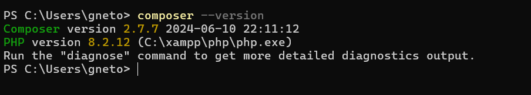
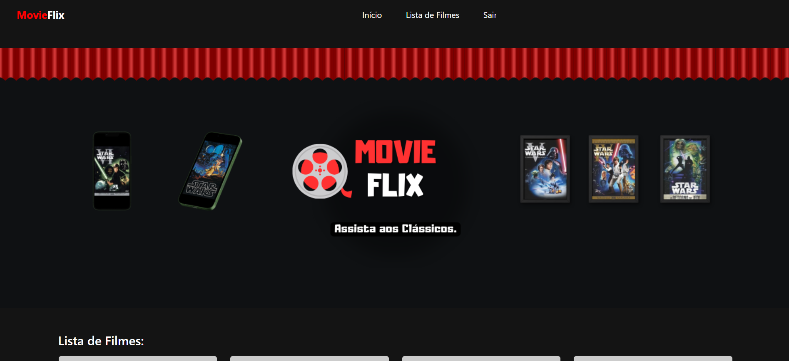

## 🚀 Começando

Para iniciar o projeto, siga as instruções destacadas abaixo para evitar problemas na execução.

## Instruções de Instalação

## Requisitos
- PHP 7.4 -  Linguagem de programação usada no desenvolvimento
- Composer - Gerenciar de dependência de PHP
- Mysql -  Banco de dados 

## Dependecia do projeto
-  Monolog/Monolog

## 🔧 Instalação
- Certifique-se de que o Composer está instalado no sistema. 
- Você pode verificar isso executando o comando a seguir no terminal.

````
 composer --version
````

Retornará isso no terminal caso esteja instalado.



caso não esteja instalado.

- Passo 1: Baixe o instalador do Composer
Acesse a página oficial do Composer:
https://getcomposer.org/download/

- Clique em Composer-Setup.exe para baixar o instalador para Windows.

- Passo 2: Execute o instalador
- Após o download, execute o arquivo Composer-Setup.exe.
- Siga as instruções do instalador:

Escolha o caminho do executável PHP:
O instalador detectará automaticamente o PHP no PATH. Caso contrário, você precisará apontar para o arquivo php.exe (exemplo: C:\xampp\php\php.exe).
Proxy (se necessário):
Caso você use um proxy para acessar a internet, configure-o aqui.
Teste a conexão:
O instalador verificará se consegue baixar pacotes da internet.
- Finalize a instalação.

- Passo 3: Verifique a instalação
- Abra o Prompt de Comando ou PowerShell.
- Digite o comando: 
````
composer --version
````

 
## Instalação da Dependecia Monolog
- Para instalar a biblioteca, execute o seguinte comando no terminal:

````
composer require monolog/monolog:^2.0 
````
### Banco de Dados

### Crie o banco de dados starwars_api com o comando:
````
CREATE DATABASE starwars_api;
````
### Importar as Tabelas e Dados
- Certifique-se de que o arquivo SQL necessário para criar as tabelas está na pasta InstallDatabase e que os dados iniciais (por exemplo, starwars_api.sql) também estão disponíveis.
- Localize o arquivo na pasta InstallDatabase e importe-o para o banco de dados utilizando sua ferramenta de gerenciamento de banco de dados preferida (como phpMyAdmin, MySQL Workbench ou um comando SQL direto no terminal).

- O arquivo de configuração do projeto deve conter os seguintes valores:
````
// Configurações gerais
define('BASE_URL', 'http://localhost/Catalogo/');
define('DB_HOST', 'db');
define('DB_NAME', 'starwars_api');
define('DB_USER', 'root');
define('DB_PASS', 'root');
````
- Certifique-se de ajustar o valor de BASE_URL para refletir o caminho correto do seu projeto no servidor local.

###  Credenciais de acesso ao MySQL:
- Usuário: root
- Senha: root

###  Testar a Conexão
- Inicie o servidor do projeto (como Apache ou Docker ou outro servidor que você esteja utilizando).
- Acesse o projeto pelo navegador no endereço definido em BASE_URL, por exemplo: 
````
http://localhost/Catalogo/
````



- Caso tenha dúvidas ou encontre problemas durante o processo, verifique o log do servidor ou entre em contato 🚀